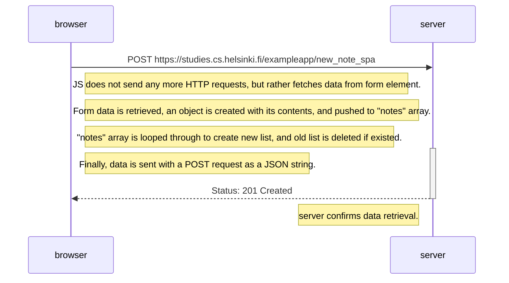

```mermaid
sequenceDiagram


    browser->>server: POST https://studies.cs.helsinki.fi/exampleapp/new_note_spa

    Note right of browser: JS does not send any more HTTP requests, but rather fetches data from form element.

    note right of browser: Form data is retrieved, an object is created with its contents, and pushed to "notes" array.

    Note right of browser: "notes" array is looped through to create new list, and old list is deleted if existed.

    activate server

    Note right of browser: Finally, data is sent with a POST request as a JSON string.

    server-->>browser: Status: 201 Created
    deactivate server
    Note left of server: server confirms data retrieval.
```
